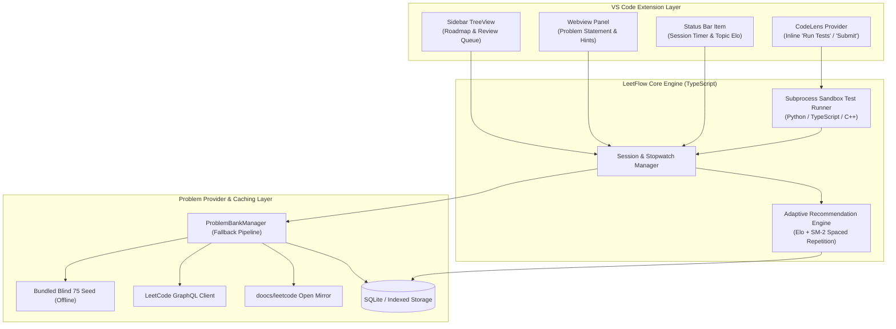
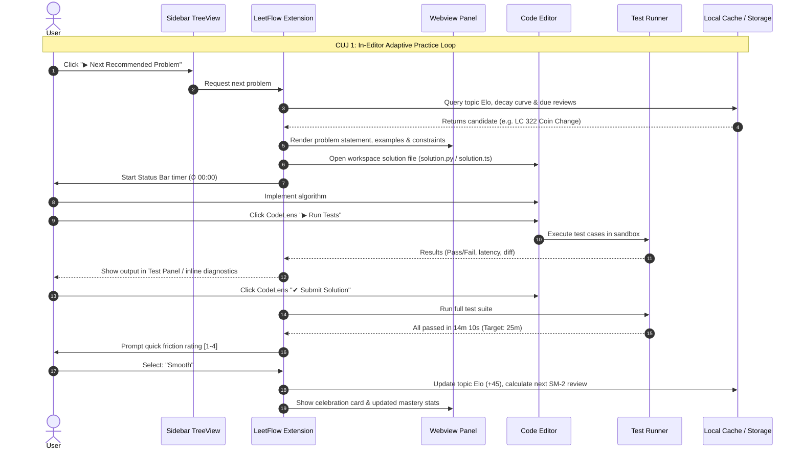
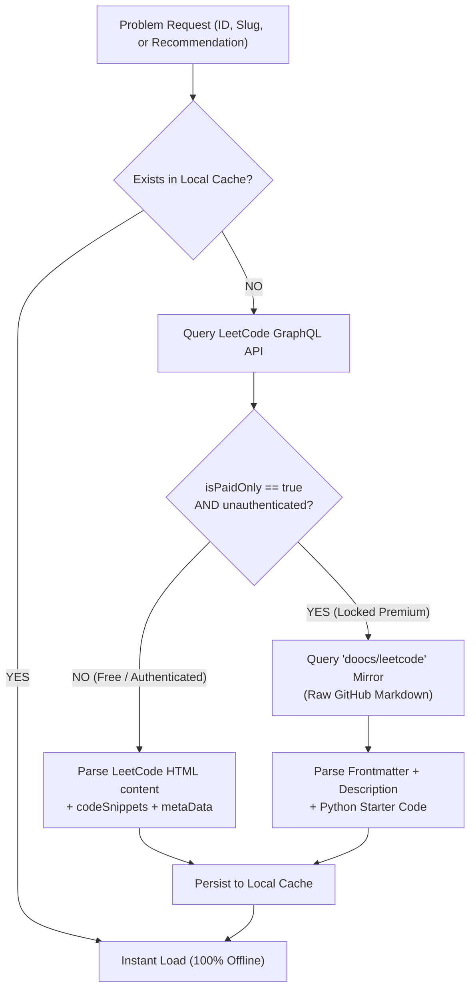

# LeetFlow: Intelligent VS Code Extension for LeetCode Practice

> Stay in the flow with adaptive algorithm recommendations, local test runners, and spaced repetition - right inside VS Code.

---

## 1. Overview & Vision

**LeetFlow** is a native VS Code extension designed to turn your editor into an intelligent, frictionless algorithm training environment. Instead of context-switching between the browser and your IDE, LeetFlow manages the entire practice lifecycle:
1. **Intelligent Problem Recommendation**: Selects optimal problems tailored to your skill level using topic Elo ratings, memory retention decay (SuperMemo-2), and curated tracks (Blind 75 / NeetCode 150).
2. **Side-by-Side In-Editor Experience**: Renders problem statements, constraints, and hints in a native Webview alongside your typed solution.
3. **Instant Local Test Harness**: Inline CodeLens actions (`▶ Run Tests`, `✔ Submit Solution`) execute test cases against your local code in <100ms with colorized visual diffs.
4. **Deep Performance Telemetry**: Tracks thinking time, solve duration vs. target benchmarks, zero-shot first-try pass rate, and cognitive friction to continuously refine your learning curve.
5. **Universal Problem Provider**: Pre-seeded with Blind 75 for instant offline practice, queries the LeetCode GraphQL API (4,000+ problems) on demand, and falls back to open-source mirrors (`doocs/leetcode`) for locked/premium problems.

---

## 2. Architecture & Component Design



---

## 3. Critical User Journeys (CUJs)



---

## 4. Problem Sourcing Strategy



---

## 5. Telemetry & Mastery Metrics

| Metric | Telemetry Point | Signal & Application |
|---|---|---|
| **Thinking Time** | $T_{\\text{think}}$ (Duration to 1st test run) | Measures immediate pattern recognition vs conceptual hesitation |
| **Duration Ratio** | $T_{\\text{solve}} / T_{\\text{target}}$ | Normalizes solve speed against industry standards (Easy: 15m, Med: 25m, Hard: 45m) |
| **Debug Duration** | $T_{\\text{solve}} - T_{\\text{think}}$ | Highlights edge-case anticipation and debugging efficiency |
| **Zero-Shot Pass Rate** | First-try pass without intermediate fails | High predictor of live whiteboard interview readiness |
| **Cognitive Friction** | 1 (Trivial) to 4 (Looked at solution) | Direct input to SuperMemo-2 quality score ($q$) for interval scheduling |
| **Half-Life Decay** | Days since last practiced topic ($R = e^{-\\Delta t / S}$) | Surfaces decaying topics to prevent knowledge loss |

---

## 6. Directory Structure & Technology Stack

- **Extension Host**: TypeScript / Bun (`package.json`, `esbuild`)
- **UI & Views**: VS Code Custom Webviews (Tailwind / VS Code Webview UI Toolkit) + TreeDataProvider
- **Runner Sandbox**: Node/Bun child process spawning isolated language runtimes (Python, TypeScript, C++, Java, Go)
- **Quality Gates**: `bun test`, `eslint`, `prettier`, `@vscode/test-electron`

```
leetflow/
├── package.json               # Extension manifest, commands & views
├── tsconfig.json              # Strict TypeScript config
├── IMPLEMENTATION.md          # System design & architecture blueprint
├── src/
│   ├── extension.ts           # Extension activation entrypoint
│   ├── commands/              # Command handlers (next, start, test, submit, review)
│   ├── providers/             # Problem sourcing (Bundled, GraphQL, doocs mirror)
│   │   ├── problem-manager.ts
│   │   ├── leetcode-graphql.ts
│   │   ├── doocs-mirror.ts
│   │   └── bundled-seed.ts
│   ├── core/                  # Pure business logic algorithms
│   │   ├── elo.ts             # Elo rating updates
│   │   ├── sm2.ts             # SuperMemo-2 interval math
│   │   ├── recommender.ts     # Multi-factor recommendation engine
│   │   └── telemetry.ts       # Metric calculations & session tracker
│   ├── runners/               # Test execution harnesses
│   │   ├── runner-interface.ts
│   │   ├── python-runner.ts
│   │   └── typescript-runner.ts
│   ├── storage/               # Persistence & local cache
│   │   ├── database.ts
│   │   └── repositories.ts
│   ├── views/                 # Native VS Code UI components
│   │   ├── treeview-provider.ts
│   │   ├── webview-panel.ts
│   │   ├── codelens-provider.ts
│   │   └── statusbar-item.ts
│   └── data/
│       └── blind75.json       # Pre-packaged Blind 75 offline dataset
└── test/
    ├── suite/
    │   ├── elo.test.ts
    │   ├── sm2.test.ts
    │   ├── recommender.test.ts
    │   ├── providers.test.ts
    │   └── runners.test.ts
    └── runTest.ts
```

---

## 7. Next Steps & Development Phases

1. **Phase 1: Project Scaffolding & Core Engine**
   - Initialize package with `bun`, configure TypeScript, esbuild, and test runner.
   - Implement core models, Elo rating formulas, SM-2 spaced repetition math, and unit test suite.
2. **Phase 2: Problem Sourcing & Fallback Pipeline**
   - Implement `ProblemBankManager` with bundled Blind 75, LeetCode GraphQL client, and `doocs/leetcode` mirror parser.
3. **Phase 3: Test Runners & Sandbox Execution**
   - Implement `PythonRunner` and `TypeScriptRunner` with input/output comparison, execution timeout guards, and diff formatting.
4. **Phase 4: VS Code UI Integration**
   - Implement Sidebar TreeView, problem description Webview panel, CodeLens buttons, and Status Bar stopwatch.
