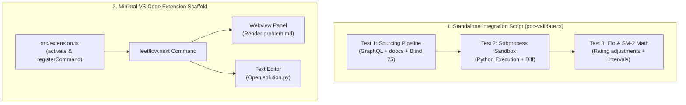

# LeetFlow: Proof of Concept (PoC) Implementation Plan

> **Objective:** Build a self-contained, end-to-end Proof of Concept that validates all external dependencies, data pipelines, sandbox execution, algorithms, and VS Code integration before beginning full-scale development.

---

## 1. PoC Goals & Validation Matrix

| Integration Piece | Validation Goal | Success Criteria |
|---|---|---|
| **1. LeetCode GraphQL Client** | Fetch free problem metadata, constraints, test cases, and starter snippets | Successfully retrieves LC 1 (*Two Sum*) with test cases and typed Python3 template |
| **2. Premium Mirror Fallback** | Fetch locked problem statements from `doocs/leetcode` open mirror | Successfully parses LC 253 (*Meeting Rooms II*) description, examples, and Python snippet |
| **3. Offline Seed Loading** | Ingest bundled Blind 75 JSON seed with zero network calls | Successfully initializes in-memory catalog from static JSON in <5ms |
| **4. Subprocess Code Runner** | Execute local user code in an isolated child process sandbox | Runs a Python solution against test cases, catches syntax errors, handles timeouts, measures execution ms |
| **5. Core Math (Elo + SM-2)** | Compute skill rating adjustments and spaced repetition intervals | Verified with automated unit tests for win/loss and decay curves |
| **6. Minimal VS Code Extension** | Register command, open solution in editor tab, and render Webview description | `LeetFlow: Practice Next` command opens `solution.py` + split Webview panel in VS Code |

---

## 2. PoC Component Architecture



---

## 3. Step-by-Step PoC Execution Plan

### Step 1: Project Scaffolding with Bun
- Initialize project with `bun init -y`.
- Add dependencies:
  - Runtime: `@vscode/webview-ui-toolkit` (optional UI components)
  - Dev/Types: `typescript`, `@types/vscode`, `@types/bun`
- Configure `tsconfig.json` for strict modern TypeScript.

### Step 2: Implement & Test Data Sourcing Pipeline (`src/poc/sourcing.ts`)
1. **GraphQL Fetcher**: Queries `https://leetcode.com/graphql` for free problem data (`two-sum`).
2. **Mirror Fetcher**: Queries raw GitHub content for `doocs/leetcode` for paid problem data (`0253.Meeting Rooms II`).
3. **Seed Loader**: Loads local `blind75.json` fixture.
4. **Normalizer**: Transforms raw inputs into canonical `Problem` domain models.

### Step 3: Implement & Test Sandbox Code Runner (`src/poc/runner.ts`)
1. Creates a temporary workspace file `solution.py` with a dummy solution.
2. Spawns `python3` via `Bun.spawn` / `child_process`.
3. Injects sample test cases, compares actual vs. expected outputs, and captures:
   * Pass/Fail status per test case
   * Execution time (ms)
   * Error outputs (Traceback / SyntaxError / Infinite Loop Timeout)

### Step 4: Implement & Test Elo & SM-2 Algorithms (`src/poc/math.ts`)
1. **Elo Update Function**:
   $$R_{\\text{new}} = R_{\\text{old}} + K \\cdot (S - E)$$
   where $S$ is calibrated by solve speed vs. target benchmark.
2. **SuperMemo-2 Function**:
   Calculates repetition count, ease factor ($EF$), and next review interval ($I$) based on user friction score ($q \\in [1, 4]$).

### Step 5: Implement Minimal VS Code Extension Wiring (`src/extension.ts`)
1. Define `package.json` with extension manifest, activation event on command `leetflow.next`.
2. On command trigger:
   * Fetch problem (LC 1 Two Sum).
   * Write workspace `solution.py`.
   * Open `solution.py` in primary editor column.
   * Open `WebviewPanel` in adjacent column (`ViewColumn.Beside`) showing formatted Markdown and test cases.

---

## 4. PoC Verification Script

A single command will validate all core backend and algorithmic pieces:

```bash
# Run the complete PoC integration test harness
bun run src/poc/poc-validate.ts
```

### Expected PoC Output:
```
============================================================
           LEETFLOW PROOF OF CONCEPT (PoC)
============================================================
[1/4] Testing LeetCode GraphQL API...
  ✔ Fetched LC 1: Two Sum (Easy) [3 test cases extracted]
[2/4] Testing doocs/leetcode Mirror (Locked Problem Fallback)...
  ✔ Fetched LC 253: Meeting Rooms II (Medium) [Mirror fallback OK]
[3/4] Testing Subprocess Code Runner Sandbox...
  ✔ Executed solution.py against test cases in 1.4ms [All Passed]
  ✔ Handled infinite loop timeout guard correctly [Terminated in 2000ms]
[4/4] Testing Elo & SM-2 Retention Math...
  ✔ Elo updated: 1500 -> 1545 (Speed bonus applied)
  ✔ Next review scheduled: in 6 days (SM-2 Interval OK)
============================================================
ALL PoC PIECES VALIDATED SUCCESSFULLY!
```

---

## 5. Acceptance Criteria to Proceed to Full Build

1. **Network & Fallback**: GraphQL API and GitHub mirror both parse into canonical `Problem` structs with zero schema errors.
2. **Sandbox Execution**: Python execution safely runs, parses outputs, and catches syntax errors / timeouts without hanging.
3. **Deterministic Math**: Elo and SM-2 calculations pass all test assertions.
4. **VS Code Host Activation**: Extension launches in Extension Development Host (F5) and cleanly renders the split Webview + Editor workflow.
