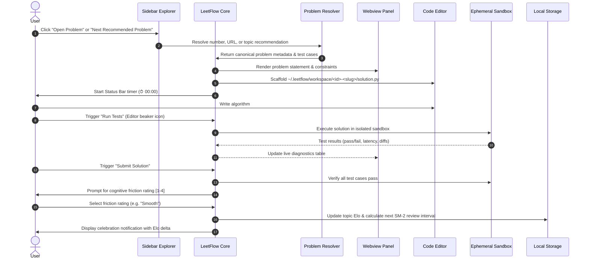

# LeetFlow: Cognitive-Engineered LeetCode Practice for VS Code

[](https://opensource.org/licenses/MIT)
[]()
[]()
[]()

**LeetFlow** is an intelligent, distraction-free LeetCode deliberate practice environment built natively inside VS Code. It combines **universal problem sourcing**, **modern Python 3.14+ template standards**, **zero-latency sandboxed test execution**, and **adaptive spaced repetition (SM-2 + Elo rating)** into a unified offline-capable workflow.

---

## 1. Key Features

### 🐍 Modern Python Template Engine
LeetCode by default provides legacy camelCase method names and deprecated `typing` generics (`List[int]`, `Optional[TreeNode]`). LeetFlow automatically modernizes all problem templates on the fly:
* **PEP 8 Compliance**: Converts methods to `snake_case` (e.g. `def two_sum(...)` or `def alien_order(...)`).
* **PEP 585 Generics**: Migrates collections to modern built-in types (`list[int]`, `dict[str, int]`, `tuple[...]`).
* **PEP 604 Union Syntax**: Replaces `Optional[T]` with clean pipe union syntax (`TreeNode | None`).
* **Auto-Injected Data Structures**: Automatically includes typed `ListNode` and `TreeNode` class helpers directly in your `solution.py` with custom constructor initializers.
* **Manual Upgrade Command**: Run `LeetFlow: Modernize Python Solution` (`leetflow.modernizeSolution`) at any time to upgrade existing code.

### 🔍 Universal Problem Sourcing & Multi-Format Opener
Open any LeetCode problem instantly without opening a browser:
* **By Problem Number**: Type `1` or `11` or `#269`.
* **By Full URL**: Paste any link like `https://leetcode.com/problems/container-with-most-water/` or `leetcode.cn` links.
* **By Title / Slug**: Type `container-with-most-water` or keywords `Median of Two Sorted Arrays`.
* **3,500+ Global Problem Catalog**: Queries live LeetCode GraphQL with automatic fallback to high-speed mirror repositories for premium/locked problems.

### ⚡ Ephemeral Sandboxed Test Runner
* **Sub-100ms Execution**: Runs your algorithm locally in an isolated subprocess with zero workspace pollution.
* **Multi-Language Support**: Full out-of-the-box support for Python 3 (`python3`) and TypeScript (`bun`).
* **Deep Equality Verification**: Intelligently compares nested arrays, matrices, object graphs, and floating point outputs.
* **Infinite Loop Guards**: Strict 4.0-second execution timeout guard (`SIGKILL`) prevents hanging editors.

### 📈 Topic Elo & Spaced Repetition (SM-2)
* **Topic-Based Elo Ratings**: Calibrates your true skill rating per pattern category (Array & Hashing, Two Pointers, Dynamic Programming, Graphs, etc.) based on solve speed and difficulty.
* **Cognitive Friction Logging**: Track your solve quality (1 - Trivial, 2 - Smooth, 3 - Struggled, 4 - Looked at Solution).
* **SuperMemo-2 (SM-2) Interval Decay**: Automatically schedules review sessions so you practice problems right at the point of forgetting.

### 📊 Native Sidebar & Interactive Dashboard
* **Practice Tracks**: Curated Blind 75 and NeetCode 150 roadmaps organized into collapsible topic folders with status indicators.
* **Proficiency & Telemetry Sidebar**: Live stats tracking total solved, Blind 75 completion rate, zero-shot pass percentage, and topic Elo ratings.
* **Interactive Stats Webview**: Rich visual dashboard opened via `LeetFlow: View Stats & Mastery`.
* **Status Bar Stopwatch**: Live timer in the bottom-right corner tracking active problem solve duration and thinking time.

---

## 2. Architecture & Dataflow



---

## 3. Commands & Controls Matrix

| Command | Identifier | Description | Shortcut / Location |
|---|---|---|---|
| **Next Recommended Problem** | `leetflow.next` | Recommends the optimal problem based on mastery and due reviews | `Cmd+Shift+P` -> `LeetFlow: Next` |
| **Open Problem by Number / URL** | `leetflow.openProblem` | Opens any problem by number (e.g. `11`), slug, or LeetCode URL | Sidebar $(search) icon |
| **Run Tests** | `leetflow.test` | Executes current solution against sample cases in ephemeral sandbox | Editor title bar $(beaker) |
| **Submit Solution** | `leetflow.submit` | Evaluates all cases, logs friction rating, and updates topic Elo | Editor title bar $(pass-filled) |
| **Modernize Python Solution** | `leetflow.modernizeSolution` | Migrates active file to PEP 8 snake_case and PEP 585/604 typing | `Cmd+Shift+P` -> `LeetFlow: Modernize` |
| **View Stats & Mastery** | `leetflow.stats` | Displays topic Elo breakdown, roadmap progress, and stats | Status Bar $(pulse) |
| **Review Due Problem** | `leetflow.review` | Opens the next problem due for spaced repetition review | `Cmd+Shift+P` -> `LeetFlow: Review` |
| **Reset Progress Data** | `leetflow.resetProgress` | Wipes attempt history and resets topic Elo ratings to fresh state | `Cmd+Shift+P` -> `LeetFlow: Reset` |

---

## 4. Installation

### Option A: Install from GitHub Releases (.vsix)
1. Download the latest `leetflow-x.x.x.vsix` release from **[GitHub Releases](https://github.com/dev-ansung/leetflow/releases)**.
2. In VS Code, open the **Extensions** view (`Cmd+Shift+X` on macOS or `Ctrl+Shift+X` on Windows/Linux).
3. Click the **`...`** (Views and More Actions) menu in the top-right corner of the Extensions sidebar.
4. Select **Install from VSIX...** and pick the downloaded `.vsix` file.

*Or install via terminal:*
```bash
code --install-extension leetflow-0.1.0.vsix --force
```

### Option B: Build from Source
Requirements: [Bun](https://bun.sh) and [VS Code](https://code.visualstudio.com/).

```bash
# 1. Clone repository
git clone https://github.com/dev-ansung/leetflow.git
cd leetflow

# 2. Install dependencies & run tests
bun install
bun test

# 3. Package extension
bun run package

# 4. Install into VS Code
code --install-extension artifacts/vsix/leetflow-0.1.0.vsix --force
```

---

## 5. Development & Testing

```bash
# Run unit & integration test suites
bun test

# Run Biome linter & code formatter
bun run lint
bun run lint:fix

# Compile bundle
bun run build
```

---

## 6. License & Author

Created and maintained by **[dev-ansung](https://github.com/dev-ansung)**.

Licensed under the **[MIT License](LICENSE)**.