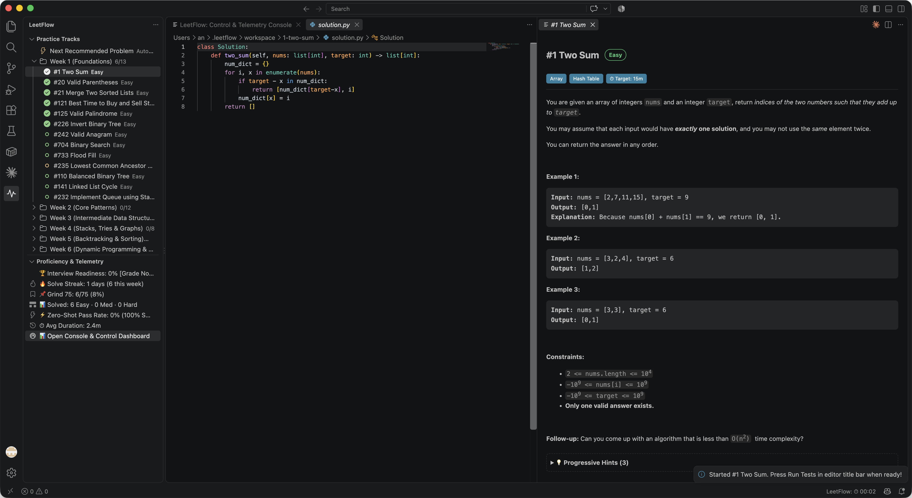
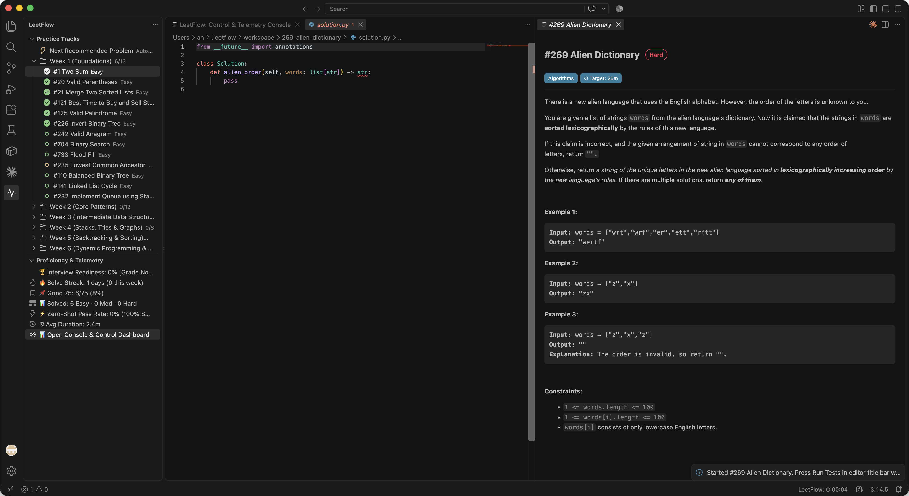
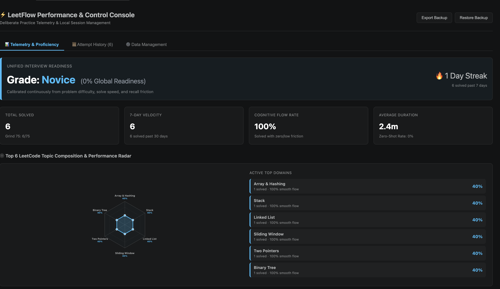
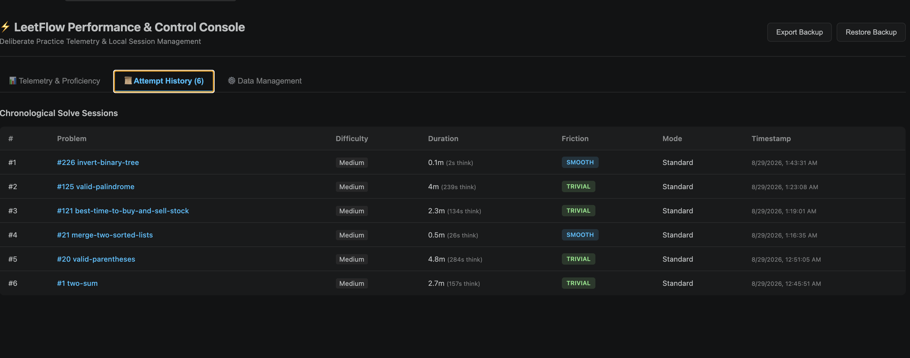

# ⚡ LeetFlow: Practice LeetCode Uninterrupted in VS Code

[](https://marketplace.visualstudio.com/items?itemName=dev-ansung.leetflow)
[](https://marketplace.visualstudio.com/items?itemName=dev-ansung.leetflow)
[](LICENSE)
[]()
[]()

> **The zero-friction, uninterrupted flow state for LeetCode practice.**  
> No browser tabs. No copy-pasting code. No manual test runner setup. **No paywall roadblocks.** Just sit down, stay in your editor, and solve problems with instant local execution, modern Python templates, and cognitive spaced repetition.

---



---

## 💡 The Core Value: Pure Uninterrupted Flow

Grinding coding interviews is full of friction: switching browser tabs, wrestling with clunky web editors, copy-pasting code back and forth to debug, dealing with outdated legacy templates (`List[int]`, `Optional[TreeNode]`, `camelCase`), hitting paywalls on company questions, and forgetting patterns you solved two weeks ago.

**LeetFlow streamlines the entire practice loop into a single, uninterrupted workflow inside VS Code:**

| What Slows You Down | How LeetFlow Keeps You in Flow |
|:---|:---|
| 🔒 **Premium & locked paywalls** | **Universal mirror sourcing** seamlessly loads locked and premium interview questions (e.g. Alien Dictionary, Meeting Rooms II) with starter templates and test cases. |
| 🔀 **Endless window switching** | Problem description and clean code open side-by-side with 1 click. |
| ⏳ **Slow remote test queues** | Sub-100ms local test execution in an isolated sandbox with zero network latency. |
| 📋 **Manual test case setup** | Auto-parses all sample cases and runs them automatically without manual setup. |
| 🦕 **Legacy Python boilerplate** | Auto-modernizes templates to modern Python standards (`list[int]`, `int | None`, `snake_case`). |
| 🧠 **The forgetting curve** | Built-in SuperMemo-2 (SM-2) spaced repetition schedules reviews right before memory decays. |
| 📊 **Vanity solve counts** | Replaces useless problem counters with an honest **0-100% Interview Readiness score** and **dynamic Top 6 topics radar chart**. |

---

## 🚀 The Seamless 4-Step Practice Loop

```
  [ 1. Pick Problem ] ──────► [ 2. Code in Editor ]
          ▲                               │
          │                               ▼
  [ 4. Friction & Next ] ◄──── [ 3. Instant Local Test ]
```

1. **Pick or Hit Next**: Click **`⚡ Next Recommended Problem`** or select a problem from curated tracks (Grind 75, Blind 75, NeetCode 150).
2. **Code with Your Own Setup**: Work with your favorite VS Code theme, Vim keybindings, Copilot, and local Python interpreter (with auto-detected Python 3.14 support).
3. **Run Tests Instantly**: Press **`▶ Run Tests`** (`$(beaker)`) in the editor title bar to evaluate all test cases locally with detailed diffs.
4. **Submit & Review**: Press **`✔ Submit Solution`** (`$(pass-filled)`), rate your cognitive friction (Trivial, Smooth, Struggled, Looked up solution), and roll straight into your next problem without breaking concentration.

---

## 🎯 Key Features

### 1. 🔓 Universal Sourcing & Zero Paywall Roadblocks
Never get stopped mid-roadmap because a crucial interview question is locked behind a paywall.



* **Automatic Fallback Mirroring**: When opening company-tagged or locked questions (e.g. `#269 Alien Dictionary`, `#253 Meeting Rooms II`, `#323 Connected Components`), LeetFlow automatically sources the full problem statement, function signatures, and sample test cases.
* **Open Anything**: Open any problem by numeric ID (`#1`, `#242`, `#269`), slug (`valid-anagram`), or full URL (`leetcode.com` / `leetcode.cn`).

---

### 2. 🐍 Modern Python Standards Out of the Box
LeetCode default templates are stuck in legacy Python 2/early-3 conventions. LeetFlow automatically modernizes all problem templates on the fly:

```python
# Clean, modern Python standard
class Solution:
    def two_sum(self, nums: list[int], target: int) -> list[int]:
        pass
```

* **PEP 8 Compliance**: Converts `camelCase` method names to `snake_case`.
* **PEP 585 Generics**: Uses built-in collections `list[int]`, `dict[str, int]`, `set[int]`.
* **PEP 604 Unions**: Clean pipe syntax `TreeNode | None` instead of `Optional[TreeNode]`.
* **Auto-Injected Helpers**: Typed `ListNode` and `TreeNode` class definitions are provided directly in your file so your IDE language server never complains.
* **Interpreter Auto-Discovery**: Automatically discovers and prioritizes modern Python 3.14 executables with a quick switch command (`LeetFlow: Select Python Interpreter...`).

---

### 3. 🔀 Curated Structured Tracks with Chronological Progression
Work through industry-standard interview preparation roadmaps with a single click. Solving a problem in one roadmap automatically checks it off across all others:

* **Grind 75** (Tech Interview Handbook 75-question curriculum ordered chronologically by weeks)
* **Blind 75** (Yangshun Tay definitive 75 questions)
* **NeetCode 150** (Canonical 150-question pattern taxonomy)
* **NeetCode 250 & NeetCode All** (Expanded deep pattern roadmaps)
* **Top Interview 150** (LeetCode official study plan)
* **Programmer Carl 200** (代码随想录 179-question step-by-step curriculum)

---

### 4. 🕸 Dynamic Top 6 Topics Performance Radar & Telemetry
Open the **Dashboard** (`Cmd+Shift+P` -> `LeetFlow: Open Dashboard`) to view:



* **Dynamic Top 6 Topics Radar Chart**: Visualizes your algorithmic strengths and coverage balance across your most practiced LeetCode topic tags (Array, Two Pointers, Dynamic Programming, Binary Tree, Graph, Greedy, etc.).
* **Unified Interview Readiness (0 - 100%) & Grade (S / A / B / C / D / Novice)**: Objective calibration of interview readiness based on problem difficulty, solve speed, zero-shot rate, and cognitive recall friction.
* **SuperMemo-2 (SM-2) Spaced Repetition**: Automatically prioritizes due reviews so you never forget a pattern before interview day.

👉 *For the complete mathematical formula and grade threshold breakdowns, see the **[Proficiency & Grading Specification (PROFICIENCY.md)](PROFICIENCY.md)**.*

---

### 5. 📜 Attempt History & Data Management
Track your chronological progress and maintain complete local data sovereignty:



* **Reset Current Solution (`$(discard)`)**: Cleanly reset your active problem back to its initial modern starter template with one click.
* **Status Bar Stopwatch**: Track active solving time with click-to-pause functionality.
* **Data Sovereignty**: Export your entire history to a JSON backup, restore anytime, or purge cached scratch files.

---

## ⌨️ Command Palette Reference

| Command | Action | Shortcut / Trigger |
|---|---|---|
| `LeetFlow: Next Recommended Problem` | Launches the next chronological problem or due review | Sidebar $(play) icon |
| `LeetFlow: Run Tests` | Executes current solution against test cases in sandbox | Editor title bar $(beaker) icon |
| `LeetFlow: Submit Solution` | Submits solution, logs friction, and updates readiness | Editor title bar $(pass-filled) icon |
| `LeetFlow: Reset Current Solution to Starter Code` | Resets current file to pristine starter template | Editor title bar $(discard) icon |
| `LeetFlow: Switch Active Roadmap Track...` | Switches between Grind 75, Blind 75, NeetCode 150, etc. | Sidebar $(arrow-swap) icon |
| `LeetFlow: Open Problem by Number, Name, or URL` | Opens any problem by # (e.g. `242`), slug, or link | Sidebar $(search) icon |
| `LeetFlow: Open Dashboard` | Opens the full 3-tab interactive telemetry center | Sidebar $(dashboard) icon |
| `LeetFlow: Select Python Interpreter...` | Picks Python 3.14 or custom virtual environment | Command Palette |
| `LeetFlow: Review Due Problem` | Launches the highest-priority scheduled SM-2 review | Command Palette |
| `LeetFlow: Reset All Progress & Telemetry Data` | Permanently resets telemetry and history | Command Palette |
| `LeetFlow: Modernize Current Solution to Modern Python` | Upgrades active file to PEP 8 snake_case & PEP 585/604 | Command Palette |
| `LeetFlow: Pause / Resume Stopwatch Timer` | Toggles stopwatch timer pause state | Click status bar timer |

---

## 📦 Installation

### Option 1: Install from VS Code Marketplace (Recommended)
Search for **`LeetFlow`** by **`dev-ansung`** in the VS Code Extensions tab (`Cmd+Shift+X`) and click **Install**.

[👉 View on Visual Studio Marketplace](https://marketplace.visualstudio.com/items?itemName=dev-ansung.leetflow)

### Option 2: Install via Terminal
```bash
code --install-extension dev-ansung.leetflow
```

---

## 🤝 Author & License

Created with ❤️ by **[dev-ansung](https://github.com/dev-ansung)**.  
Licensed under the **[MIT License](LICENSE)**.