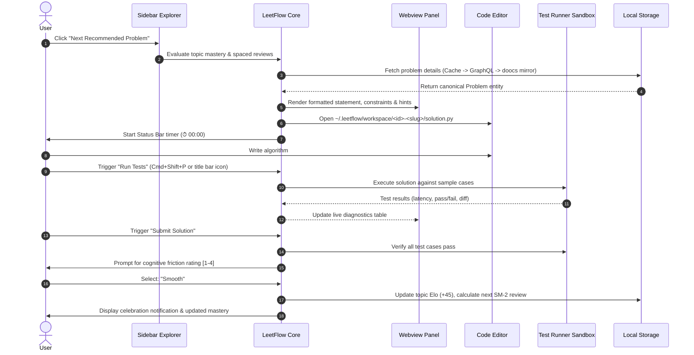

# LeetFlow: Intelligent VS Code Extension for LeetCode Practice

<p align="center">
  <h1>⚡ LeetFlow</h1>
</p>

<p align="center">
  <strong>Stay in the flow with adaptive algorithm recommendations, local test runners, and spaced repetition - right inside VS Code.</strong>
</p>

<p align="center">
  <a href="#features"></a>
  <a href="#quick-start"></a>
  <a href="#architecture"></a>
  <a href="#automated-testing"></a>
  <a href="#license"></a>
</p>

---

## 1. Why LeetFlow?

Grinding algorithm problems in a browser tab is fraught with friction:
- **Context Switching**: Copy-pasting boilerplate code between browser text areas and your local IDE.
- **Random Grinding**: Jumping across topics without calibration, tackling problems that are either trivially easy or demotivatingly difficult.
- **The Forgetting Curve**: Solving a tricky Dynamic Programming or Graph problem today, only to completely freeze on it during a real technical interview a month later.

**LeetFlow turns your editor into a high-velocity algorithm training gym**:
1. **Adaptive Recommendation Engine**: Calibrates each session using an Elo skill rating per topic to keep you in the optimal *Zone of Proximal Development*.
2. **In-Editor Side-by-Side Canvas**: Automatically renders clean problem statements, constraints, and hints in a native Webview tab beside your solution.
3. **Instant Local Test Harness**: Executes your code in <100ms against sample inputs with rich colorized diffs and infinite-loop timeout protection.
4. **Spaced Repetition (SuperMemo-2)**: Automatically schedules reviews before memory decay sets in.
5. **Universal Problem Provider**: Pre-seeded with Blind 75 for instant offline practice, queries the LeetCode GraphQL API (4,000+ problems), and falls back seamlessly to open mirrors (`doocs/leetcode`) for locked/premium questions.

---

## 2. Core Features

```
┌─────────────────┬───────────────────────────────┬───────────────────────────────┐
│ LEETFLOW TREE   │ 📄 solution.py (Editor Tab)   │ 🌐 Problem Description        │
│                 │                               │    (Webview Side Panel)       │
├─────────────────┼───────────────────────────────┼───────────────────────────────┤
│ ▼ Recommended   │ class Solution:               │ # 322. Coin Change (Medium)   │
│   ⭐ LC 322 (DP) │     def coinChange(self, ...):│                               │
│                 │         # Implement algorithm │ You are given an integer array│
│ ▼ Blind 75 (48%)│         ...                   │ coins representing coins...   │
│   ▶ Arrays (8/8)│                               │                               │
│   ▼ DP (6/12)   │ ----------------------------- │ **Example 1:**                │
│     ✔ LC 70     │ 🧪 TEST RESULTS (Output Panel)│ Input: coins = [1,2,5]        │
│     ✔ LC 300    │ Case 1: [1,2,5], 11 -> 3 [✔]  │ Target: 11                    │
│     ⭐ LC 322   │ Case 2: [2], 3 -> -1     [✔]  │ Output: 3                     │
│                 │ Speed: 1.4ms (Passed)         │                               │
├─────────────────┴───────────────────────────────┴───────────────────────────────┤
│ ⏱ 14m 10s | 📈 DP Elo: 1540 (+45) | Next Review: in 6 days                      │
└─────────────────────────────────────────────────────────────────────────────────┘
```

### 🎯 Adaptive Problem Sourcing & Recommendation
- **Multi-Factor Scoring**: Evaluates candidate problems using topic deficiency, memory decay, and difficulty match.
- **Offline-First Starter Seed**: Ships with the curated **Blind 75** dataset for zero-latency, 100% offline practice.
- **On-Demand 4,000+ Problem Sync**: Fetches official problem specifications, constraints, and test cases directly from LeetCode GraphQL.
- **Transparent Premium Fallback**: Automatically fetches locked/premium questions (e.g. *Meeting Rooms II*, *Alien Dictionary*) from the `doocs/leetcode` open mirror.

### 🧪 Sandboxed Subprocess Test Runner
- **Sub-100ms Execution**: Runs your local solution against sample test cases using an isolated background subprocess.
- **Rich Visual Diffs**: Displays exact actual vs. expected values for primitives, lists, dictionaries, and custom data structures.
- **Safety Guards**: Enforces strict timeout limits (default: 4000ms) to safely terminate infinite loops without freezing your IDE.

### 🧠 Spaced Repetition (SuperMemo-2 Algorithm)
- **Cognitive Friction Logging**: A 3-second prompt upon submission (*Trivial / Smooth / Struggled / Looked at Solution*) calibrates the memory retention interval.
- **Decay Warnings**: Notifies you when high-yield patterns are approaching memory decay.

### 📊 Deep Telemetry & Metrics Tracking
- **Thinking Time ($T_{\\text{think}}$)**: Measures time before your first test run to isolate pattern recognition from implementation speed.
- **Duration Ratio**: Compares total solve time against industry benchmarks (Easy: 15m, Medium: 25m, Hard: 45m).
- **Zero-Shot Pass Rate**: Tracks whether you solved the problem on the first attempt without intermediate bugs.

---

## 3. Architecture & Dataflow



---

## 4. Commands & Controls Matrix

| Command | Identifier | Description | Shortcut |
|---|---|---|---|
| **Next Recommended Problem** | `leetflow.next` | Analyzes your mastery and starts the next optimal problem session | `Cmd+Shift+P` $\rightarrow$ `LeetFlow: Next` |
| **Open Problem by Number / URL** | `leetflow.openProblem` | Opens any problem by number (e.g. `11`), slug, or LeetCode URL | Sidebar $(search)$ icon |
| **Run Tests** | `leetflow.test` | Executes current solution against sample cases in sandbox | Editor title bar $(beaker)$ |
| **Submit Solution** | `leetflow.submit` | Evaluates all cases, stops timer, logs friction rating, and updates Elo | Editor title bar $(pass-filled)$ |
| **Modernize Python Solution** | `leetflow.modernizeSolution` | Migrates active file to PEP 8 snake_case and PEP 585/604 typing | `Cmd+Shift+P` |
| **View Stats & Mastery** | `leetflow.stats` | Displays topic Elo radar, roadmap progress, and practice streaks | Status Bar click |
| **Reset Progress Data** | `leetflow.resetProgress` | Wipes attempt history and resets topic Elo ratings to fresh state | `Cmd+Shift+P` |

---

## 5. Quick Start & Installation

### Option A: Install from GitHub Release (.vsix)
1. Download the latest `leetflow-x.x.x.vsix` release archive from **[GitHub Releases](https://github.com/youngyangyang04/leetflow/releases)**.
2. In VS Code, open the **Extensions** view (`Cmd+Shift+X` or `Ctrl+Shift+X`).
3. Click the **`...`** (Views and More Actions) menu in the top-right corner of the Extensions sidebar.
4. Select **Install from VSIX...** and pick the downloaded `.vsix` file.

*Alternatively via command line:*
```bash
code --install-extension leetflow-0.1.0.vsix --force
```

### Option B: Build from Source with Bun
```bash
# 1. Install dependencies
bun install

# 2. Run unit tests
bun test

# 3. Build & package extension
bun run package

# 4. Install packaged VSIX
code --install-extension artifacts/vsix/leetflow-0.1.0.vsix --force
```

---

## 6. Development & Quality Tooling

LeetFlow adheres strictly to modern TypeScript and clean architecture principles:

```bash
# Run automated integration tests
bun test

# Build extension bundle
bun run build

# Package extension into local VSIX archive
bun run package
```

### Automated Integration Test Suite (`test/suite/integration.test.ts`)
- `✔` **Sourcing**: Live LeetCode GraphQL API query and parsing.
- `✔` **Sandbox**: Subprocess execution against valid Python implementations.
- `✔` **Error Handling**: Catching failing test cases, syntax exceptions, and infinite loops.
- `✔` **Elo Math**: Accurate skill adjustment calculations with speed bonuses.
- `✔` **SM-2 Math**: Correct spaced repetition interval progression.

---

## 7. Roadmap

- [x] Multi-source problem provider (LeetCode GraphQL + `doocs/leetcode` mirror + Blind 75 seed)
- [x] Subprocess Python test runner with latency tracking & timeout guards
- [x] Side-by-side problem statement Webview panel
- [x] Elo rating system & SuperMemo-2 (SM-2) spaced repetition engine
- [x] Status bar live stopwatch & activity bar treeview
- [ ] TypeScript / Bun solution runner support
- [ ] C++ / Java runner support
- [ ] NeetCode 150 & Grind 75 roadmap tracks
- [ ] VS Code native Test Explorer (`vscode.TestController`) integration

---

## 8. License

MIT License. Crafted for engineers aiming to master coding interviews through deliberate, focused practice.
